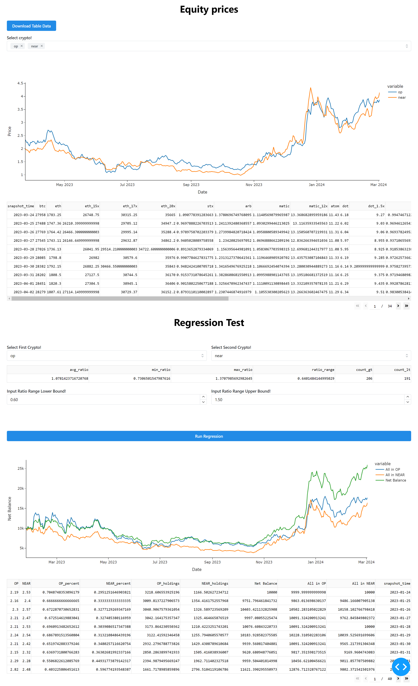

# Crypto Insights

## Introduction

Collection of crypto insights and analysis.

## Usage

```bash
python visualization_app.py
```

## Analysis

Warning: Result is highly subjected to overfitting. I'm lazy, I do not want to test further. Use at your own risk.

Strategy:
We re-balance on every day and only trade when the usd trading will be greater than 10 pecent of total money.
When lower bound and upper bound are 0.85, 1.15 regression gives the best result, which is about 3 times of the
original money after a year.

## Examples

